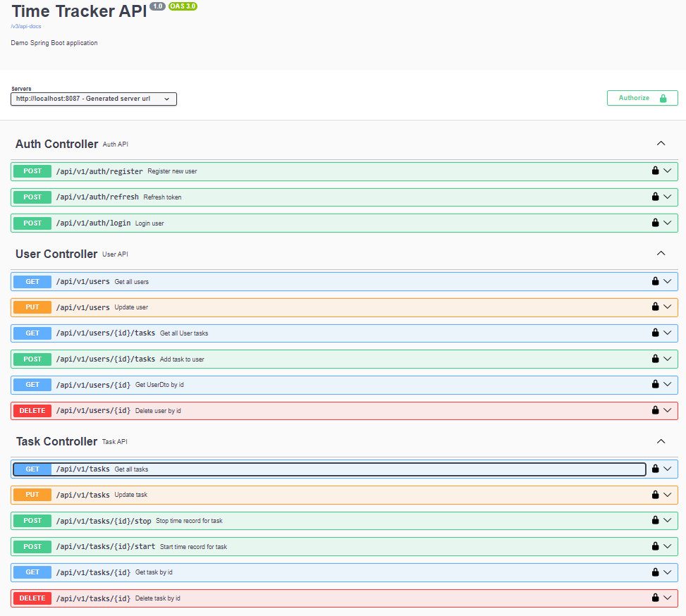

# TimeTracker

Тестовое задание Java trainee Krainet
Реализовать api приложения тайм-трекера (система для фиксирования времени, затраченного на работу) на языке Java/Kotlin.

## Структура проекта

Система Time-Tracking. Администратор добавляет, удаляет пользователей и закрепляет за пользователем задачу.
У пользователя может быть одна или несколько задач. Пользователь отмечает кол-во затраченного времени на каждую задачу.

## Стек технологий

- Java 21
- Spring Boot 3.3.4
- Spring Security
- Spring Data JPA 
- Spring Web MVC
- Spring Validation
- SpringDoc-OpenAPI
- Json Web Token
- PostgreSQL
- Liquibase
- Junit 5
- Lombok
- MapStruct
- Docker Compose
- Maven

## Инструкции

- Клонировать репозиторий: `git clone https://github.com/JavaCoDED78/TimeTracker`
- Перейти в директорию проекта. Для запуска приложения необходимо передать переменные в файл`.env`.
Вы можете использовать пример файла `.env.example` с некоторыми предопределенными переменными среды.
- Для запуска контейнера используйте команду: `compose up -d`.
- Приложение работает на порту `8087`.
- Перейти по адресу `http://localhost:8087/swagger-ui/index.html`
- Авторизоваться в приложении можно по эндпоинту `/api/v1/auth/login` со следующими данными:
    - username: `johndoe@gmail.com`
    - password: `qwerty`
- Получить токены доступа и протестировать приложение.

